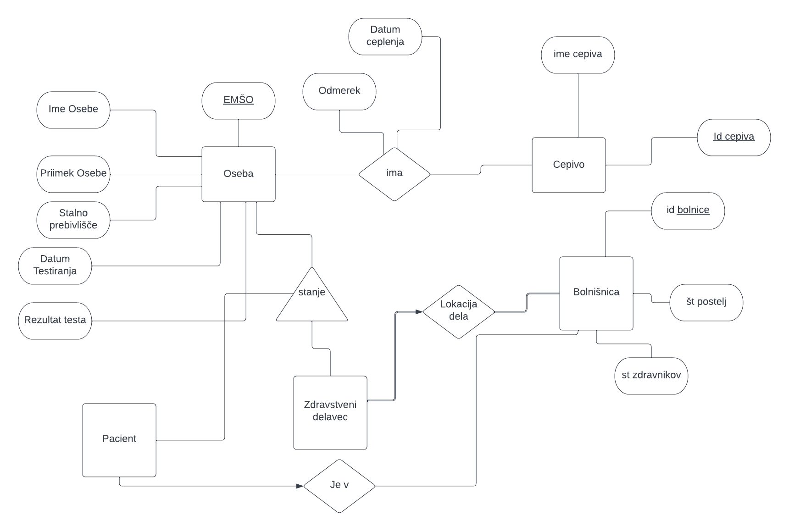
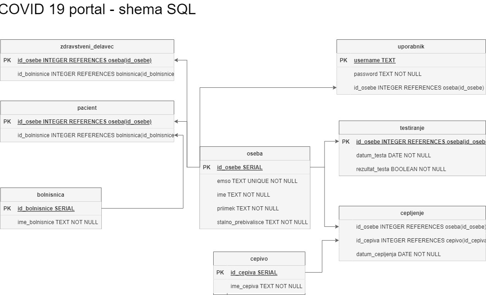

# COVID-19 portal
## Projektna nalogi pri predmetu Osnove podatkovnih baz

*  Aplikacija `bottle.py`
*  Jupyter

Aplikacija je preprost primer uporabe podatkovnih baz, pri čemer imajo uporabniki glede na različne vloge tudi različne pravice. Na portalu imamo **zdravstvene delavce** in **paciente**. V celotni populaciji so nekateri cepljeni in/ali testirani.
Pacient si lahko ogleda svoje splošne podatke in svojo PCT potrdilo. Zdravstveni delavec ima poleg teh možnosti še dodajanje novih pacientov in odstranjevanje pacientov v svoji bolnišnici.
Ker podatkov ni mogoče pridobiti, sva podatke generirala preko spletnih virov na način, da se najbolje opiše slovensko prebivalstvo. Seveda zelo poenostavljeno.

## Dostopi pri uporabi aplikacije

### zdravstveni delavec
uporabniško ime: `admin`

geslo: `admin`

### cepljena oseba
uporabniško ime: `tadej`

geslo: `tadej`

### oseba brez pctja
uporabniško ime: `neja`

geslo: `neja`

### neregistrirana oseba
ime: `Irena`

priimek: `Juteršnik`

emšo: `0607003505685`

### oseba, ki jo lahko sprejmemo v bolnišnico
ime: `Tadej`

priimek: `Hudžar`

emšo: `2607995500554`

### Opombe
 - Svojih računov z lastnimi podatki ni mogoče kreirati, saj aplikacija v odzadju preverja ali so dani podatki res v bazi prebivalstva
 - Spodnji ER diagram je od iz začetka izdelave projekta, zato sem pripravil sem diagram vseh tabel v SQL-u in kakšne so povezave med njimi

### ER diagram

### SQL diagram

